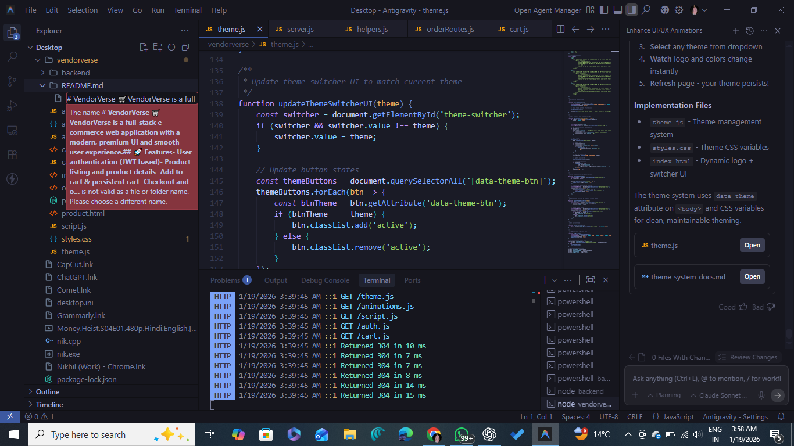

# VendorVerse Backend API

Multi-vendor e-commerce marketplace backend built with Node.js, Express.js, and MongoDB.

## 📁 Project Structure

```
backend/
├── config/
│   └── database.js          # MongoDB connection
├── controllers/
│   ├── authController.js    # User authentication
│   ├── productController.js # Product CRUD
│   ├── cartController.js    # Shopping cart
│   └── orderController.js   # Order management
├── middlewares/
│   └── authMiddleware.js    # JWT authentication
├── models/
│   ├── User.js              # User schema
│   ├── Product.js           # Product schema
│   ├── Cart.js              # Cart schema
│   └── Order.js             # Order schema
├── routes/
│   ├── authRoutes.js        # Auth endpoints
│   ├── productRoutes.js     # Product endpoints
│   ├── cartRoutes.js        # Cart endpoints
│   └── orderRoutes.js       # Order endpoints
├── utils/
│   └── helpers.js           # Utility functions
├── .env                     # Environment variables
├── .env.example             # Example env file
├── .gitignore               # Git ignore rules
├── package.json             # Dependencies
├── README.md                # Documentation
└── server.js                # Main entry point
```

## 🚀 Quick Start

### Prerequisites
- Node.js 18+
- MongoDB (local or Atlas)

### Installation

```bash
# Navigate to backend folder
cd backend

# Install dependencies
npm install

# Copy environment file and configure
cp .env.example .env

# Edit .env with your MongoDB URI and JWT secret
```

### Running the Server

```bash
# Development mode (with hot reload)
npm run dev

# Production mode
npm start
```

Server will run on `http://localhost:5000`

## 📡 API Endpoints

### Test & Health
| Method | Endpoint | Description |
|--------|----------|-------------|
| GET | `/api/test` | Test endpoint |
| GET | `/api/health` | Health check |

### Authentication
| Method | Endpoint | Description |
|--------|----------|-------------|
| POST | `/api/auth/register` | Register user |
| POST | `/api/auth/login` | Login user |
| GET | `/api/auth/me` | Get profile (protected) |
| PUT | `/api/auth/me` | Update profile (protected) |
| PUT | `/api/auth/change-password` | Change password (protected) |

### Products
| Method | Endpoint | Description |
|--------|----------|-------------|
| GET | `/api/products` | Get all products |
| GET | `/api/products/featured` | Get featured products |
| GET | `/api/products/:id` | Get single product |
| POST | `/api/products` | Create product (seller/admin) |
| PUT | `/api/products/:id` | Update product (seller/admin) |
| DELETE | `/api/products/:id` | Delete product (seller/admin) |

### Cart
| Method | Endpoint | Description |
|--------|----------|-------------|
| GET | `/api/cart` | Get user's cart |
| POST | `/api/cart/items` | Add item to cart |
| PUT | `/api/cart/items/:productId` | Update cart item |
| DELETE | `/api/cart/items/:productId` | Remove from cart |
| DELETE | `/api/cart` | Clear cart |

### Orders
| Method | Endpoint | Description |
|--------|----------|-------------|
| POST | `/api/orders` | Create order |
| GET | `/api/orders` | Get user's orders |
| GET | `/api/orders/:id` | Get order details |
| POST | `/api/orders/:id/cancel` | Cancel order |
| PUT | `/api/orders/:id/status` | Update status (admin) |

## 🔐 Environment Variables

```env
MONGO_URI=mongodb://localhost:27017/vendorverse
JWT_SECRET=your_super_secret_jwt_key
PORT=5000
NODE_ENV=development
```

## 🧪 Testing the API

```bash
# Test endpoint
curl http://localhost:5000/api/test

# Register user
curl -X POST http://localhost:5000/api/auth/register \
  -H "Content-Type: application/json" \
  -d '{"firstName":"John","lastName":"Doe","email":"john@example.com","password":"password123"}'

# Login
curl -X POST http://localhost:5000/api/auth/login \
  -H "Content-Type: application/json" \
  -d '{"email":"john@example.com","password":"password123"}'
```

## 📦 Dependencies

- **express** - Web framework
- **mongoose** - MongoDB ODM
- **cors** - Cross-origin resource sharing
- **dotenv** - Environment variables
- **bcryptjs** - Password hashing
- **jsonwebtoken** - JWT authentication
- **nodemon** - Development hot reload

## 📄 License

MIT License

